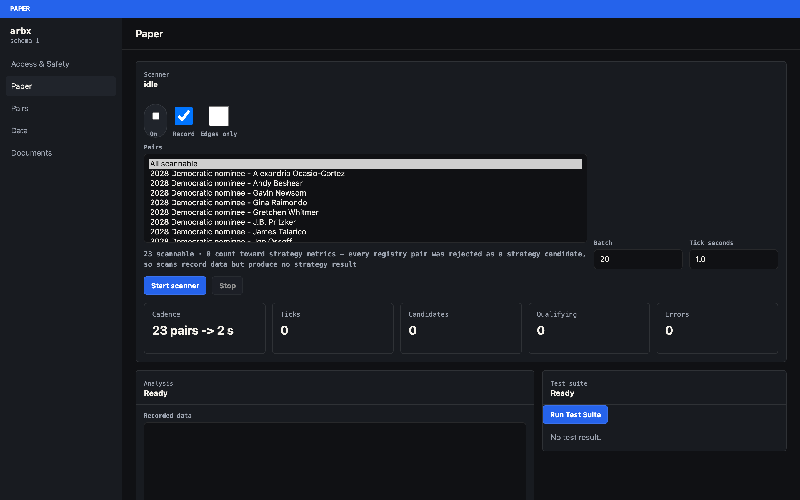
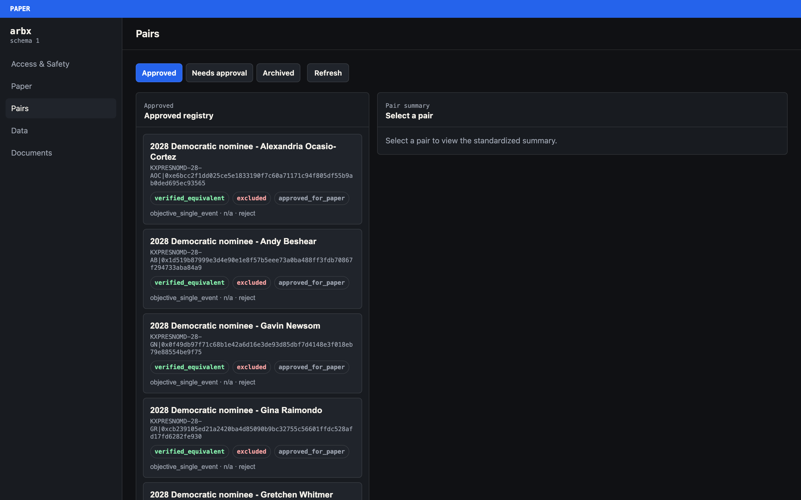
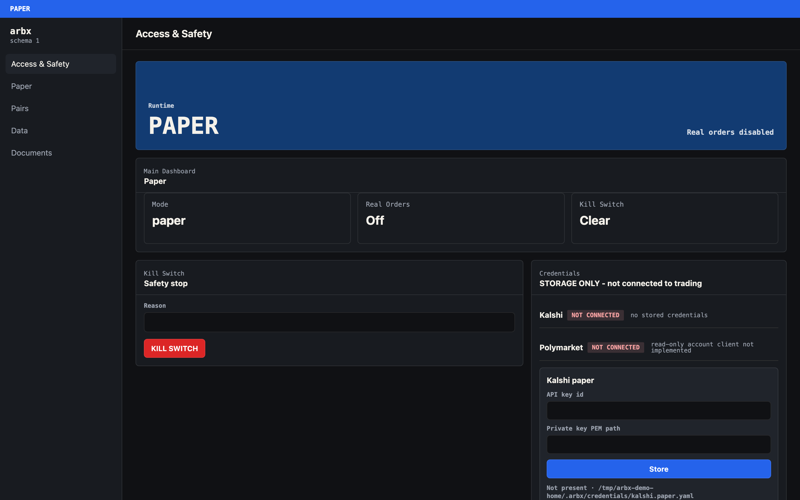
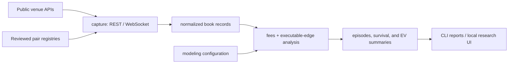

# Prediction Market Arbitrage

[](LICENSE)
[](https://www.python.org/downloads/)
[](https://github.com/frahank/prediction-market-arbitrage/actions/workflows/ci.yml)
[](#) [](#)

I built a cross-venue research platform to answer one question: **is there
capturable arbitrage between Kalshi and Polymarket?**

The answer was no — and getting to a *trustworthy* no was the hard part. An
early run looked genuinely profitable until I traced it to a bid/ask
normalization bug in my own capture path. Once that was fixed, the opportunity
disappeared. That correction is the most useful thing in this repository, and it
is documented in full in
[`docs/book_semantics_fix.md`](docs/book_semantics_fix.md).

This is the public research release: a paper-only, read-only subset of a larger
private system. It ships 23 reviewed market pairs rather than the full 97, and
carries no execution layer, no database tier, and no live-order path. What it
does carry is the part worth reading — the capture, normalization, fee,
equivalence, and safety machinery, plus the evidence that killed the strategy.

By **[Farhan M Khan](https://farhank.dev)** · MIT licensed · 416 tests at 84%
coverage · mypy clean · CI on Linux and macOS

```bash
git clone https://github.com/frahank/prediction-market-arbitrage
cd prediction-market-arbitrage
./run
```

One command: builds the environment, installs the pinned runtime, and opens the
research cockpit at <http://127.0.0.1:8710>. No credentials required — press
`n` at the prompt, or pass `--no-credentials`.

## The cockpit



The Paper tab reports the project's conclusion as a live number rather than a
claim: **23 scannable · 0 count toward strategy metrics.** A scan records real
public order-book data and deliberately produces no strategy result, because
every pair in the bundled registry was rejected during review. The negative
finding is enforced by the loader, not just written in prose.



Every pair carries three independent states: settlement equivalence
(`verified_equivalent`), strategy eligibility (`excluded`), and scan status
(`approved_for_paper`). A pair can be genuinely equivalent and still be excluded
from every reported metric. Keeping those separate is what stops a
similar-looking contract from quietly entering the results.



Real orders require three independent gates and are denied by default whenever
any one of them is missing. The kill switch has no un-engage method anywhere in
the codebase — clearing it is a manual file removal by the operator, and a test
enforces that.

## What I found

The strategy is **not viable** under the conditions I could test. That is a
finding about the market, not a verdict on the work: the experiment ran and it
returned a clear answer.

- Apparent opportunities disappeared once I applied correct bid/ask handling,
  real venue fees, settlement-equivalence checks, capture-skew limits, and
  latency tests.
- The gaps that did persist looked like market basis or long-duration collateral
  carry, not free capturable profit.
- Displayed-book survival never converted into proof of a real fill, so nothing
  justified moving toward live execution.

These results cover the reviewed pairs I tested. They do not prove that no
cross-venue arbitrage exists anywhere; they show that this implementation, on
these markets, did not find one worth deploying. The full reasoning is in
[`docs/FINAL_VERDICT.md`](docs/FINAL_VERDICT.md).

This is research software, not financial advice. It makes no claim of
profitability and has no supported live-order path.

## What you get on the first scan

The bundled registry ships 23 pairs, all scannable and **none**
strategy-eligible. Those are different things:

- **Scannable** — the scanner may record the pair's public book. Governed by
  `status: approved_for_paper`.
- **Strategy-eligible** — the pair counts toward reported strategy metrics.
  Governed by `include_in_strategy_metrics`, which the loader forces to `false`
  unless equivalence is verified *and* the latest decision-log entry is
  `approve`.

Every pair here was rejected during the original review, so a scan records real
data and produces no strategy result. `./run --check` keeps all three counts
visible:

```
release check passed: mode=paper registry=23 scannable=23 strategy_eligible=0 ui_routes=5
```

### Pairs are the sensitive part — check them yourself

Deciding that two markets settle on the same condition is the
highest-consequence judgement in this project, and the one most likely to cost
you money if you get it wrong. Two contracts with near-identical titles can
resolve differently on a detail in the fine print. When that happens you are not
holding an arbitrage; you are holding two positions that can both lose.

**Human review is not optional here.** Nothing in this repository approves a
pair on its own. The matcher proposes on a title heuristic, the prescreen only
ever flags, and the deny-by-default gate keeps a pair out of every reported
metric until a person records an `approve` decision under their own name.

**The bundled registry is a dated snapshot that only shrinks.** Prediction
markets expire — that is their normal life, not an edge case. The original
research ran against a far larger, constantly churning candidate set; most of
those markets are gone. Elections resolve, tournaments end, and anything built
on a dated cutoff eventually settles and stops trading.

You can see it in the repo: `configs/pairs.archived.yaml` holds three 2026 Men's
World Cup continent-winner pairs, each with a decision log ending in `archive` —
live and reviewed until the tournament finished. Two of the ~20 still active
close in December 2026 for the same reason. Every pair here was reviewed against
the venues' rules text **as it read on its approval date**, and venues amend
resolution criteria after listing.

`make pair-health` checks that both legs still answer on the public API. That is
**liveness, not equivalence** — a pair can be open on both venues and still
settle differently.

**You can find and verify your own pairs.** The full pipeline ships here, is
read-only, and needs no credentials: discover public markets, build a candidate
queue, snapshot both venues' rules text, run the deterministic prescreen, work
through the rules-diff audit (yourself or with a model as a first pass), then
record the decision.

```bash
# discover → queue → snapshot + prescreen + audit prompt → record → check
./.venv/bin/python scripts/discover_kalshi_public_markets.py --help
./.venv/bin/python scripts/review_pair_candidates.py --list
./.venv/bin/python scripts/audit_pair_equivalence.py <PAIR> --prompt-out audit.txt
./.venv/bin/python scripts/pair_decide.py --pair <PAIR> --decision approve     --rationale "..." --auditor "you"
make pair-health
```

Every tool takes `--pairs`, so you can keep your own registry and never touch
the bundled one.

**Start here:** [`docs/adding_pairs.md`](docs/adding_pairs.md) is the
step-by-step guide, including what actually sank pairs in practice (grouping
schemes that don't align, cutoff windows, subjective resolution language,
replacement clauses). [`docs/pair_equivalence_checklist.md`](docs/pair_equivalence_checklist.md)
is the standalone human checklist, and
[`docs/pair_testing_pipeline.md`](docs/pair_testing_pipeline.md) covers the
testing workflow once a pair is approved.

## How it works



| Path | What it contains |
|---|---|
| `src/arbx/venues` | Read-only public Kalshi and Polymarket REST clients. |
| `src/arbx/capture` | Concurrent REST and market-data WebSocket capture. |
| `src/arbx/data` | Recording, normalization, freshness, quality checks, and compaction. |
| `src/arbx/pairs` | Pair registries, settlement-equivalence checks, and rules snapshots. |
| `src/arbx/fees` | Venue-specific fee models and unified fee calculations. |
| `src/arbx/analysis` | Executable edges, episodes, survival, and heatmaps. |
| `src/arbx/modeling` | Depth, latency, carry, failed-leg, and expected-value adjustments. |
| `src/arbx/scanner` | Continuous pair rotation and edge-row generation. |
| `src/arbx/services` | Application services used by the local UI. |
| `src/arbx/ui` | FastAPI routes, templates, static assets, and response schemas. |
| `src/arbx/accounts` | Read-only account inspection and external credential references. |
| `src/arbx/exec` | Kill-switch support only; no order execution. |
| `scripts/` | Runnable discovery, capture, analysis, UI, and safety commands. |
| `configs/` | Runtime settings, economic assumptions, and pair registries. |

`arbx` is the Python import namespace used throughout the source, as in
`from arbx.analysis import ...`.

[`docs/ARCHITECTURE.md`](docs/ARCHITECTURE.md) covers the layering, the three
seams the system is designed to be pulled apart at, what it would actually take
to add a third venue, and the three module cycles that exist today.

### Pick a workflow

| Goal | Start here | Credentials |
|---|---|---|
| Discover markets | `scripts/discover_kalshi_public_markets.py`, `scripts/discover_polymarket_public_markets.py` | None |
| Record both venues by polling | `scripts/run_capture.py --mode rest_concurrent` | None |
| Record both venues event-by-event | `scripts/run_streaming_soak.py` | Kalshi key only |
| Analyze a completed capture | `scripts/run_soak_analysis.py` | None |
| Review candidate market pairs | `scripts/review_pair_candidates.py` | None |
| Open the research cockpit | `scripts/run_ui.py` | None |
| Run all regression tests | `python -m pytest -q` | None |

Operator commands:

```bash
./run --check                 # bootstrap + offline release check; no UI
make test                     # full offline suite
make lint                     # pinned lint policy
make typecheck                # mypy over src/arbx
make coverage                 # test suite with a coverage report
make pair-health              # live, read-only validation of active pairs
```

Setup details, the no-credential paths, and authenticated streaming are in
[`docs/RUNNING.md`](docs/RUNNING.md).

## Credentials

Poll-driven testing works with **no keys from either venue**. A Kalshi API key
is needed for exactly one thing: Kalshi's market-data WebSocket, which requires
a signed handshake even for public book data.

| Activity | Kalshi key | Polymarket key |
|---|---:|---:|
| Unit and offline fixture tests | No | No |
| Public REST discovery and poll-driven capture | No | No |
| Polymarket market-data WebSocket | No | No |
| Kalshi market-data WebSocket | **Yes** | No |
| Live trading | Not supported | Not supported |

The key ID and PEM **path** are stored outside the checkout under
`~/.arbx/credentials/` at mode 600; the PEM itself never moves. Onboarding
validates the key locally and makes no network request. Prefer the CLI
(`arbx-store-credentials kalshi paper`) over the cockpit's form — see
[`SECURITY.md`](SECURITY.md) for the local threat model.

Never commit credential YAML, PEM files, `.env` files, or generated auth
headers.

## What's included

- Read-only Kalshi and Polymarket public-data clients
- Concurrent REST and WebSocket capture
- Order-book normalization, including the documented bid/ask correction
- Pair-equivalence registries and review tooling
- Fee, executable-edge, survival, latency, and profitability analysis
- A local FastAPI research cockpit
- 416 tests at 84% coverage, including architecture tests that assert account
  clients stay read-only by type and that no live-execution module exists

The multi-gigabyte raw capture archive and the private research corpus are
deliberately not in Git. This repository is the software, not the data.
[`tests/fixtures/rules_snapshot/kalshi_market.json`](tests/fixtures/rules_snapshot/kalshi_market.json)
is a representative sample of a real venue response.

## Limitations

- This is archived research, not a maintained trading system.
- Venue APIs, schemas, fees, and rules may have changed since the 2026 runs.
- Similar market titles do not prove equivalent settlement conditions.
- Displayed-book calculations are not realized fills.
- Pairs expire. Markets from a past election, season, or dated cutoff will
  settle and stop trading, and the registry does not prune itself.

The safety boundary is documented in [`docs/SAFETY.md`](docs/SAFETY.md), and the
pair-testing workflow in
[`docs/pair_testing_pipeline.md`](docs/pair_testing_pipeline.md).

## Building on it

The project intentionally ships no live switch or order-capable adapter.
[`docs/LIVE_ADAPTER_GUIDE.md`](docs/LIVE_ADAPTER_GUIDE.md) maps the reusable
components, a recommended out-of-tree architecture, the two-leg state machine,
and the risk and reconciliation requirements for anyone building their own
execution layer. Third-party adapters are not supported or certified here.

## Author and credits

Built and researched by **Farhan M Khan**.

- Portfolio and project write-up: <https://farhank.dev>
- GitHub: <https://github.com/frahank>
- Contact: <Farhan.khanev@gmail.com>

The design decisions, fee and equivalence models, safety boundary, and the
negative result in [`docs/FINAL_VERDICT.md`](docs/FINAL_VERDICT.md) are my own
work. If you use this code or reproduce the methodology, a link back is
appreciated but not required.

### Third-party components

This project depends on, but does not vendor, the following open-source
packages. Each remains under its own license; versions are pinned in
[`requirements.lock`](requirements.lock) and [`pyproject.toml`](pyproject.toml).

| Package | Purpose | License |
|---|---|---|
| [cryptography](https://github.com/pyca/cryptography) | RSA-PSS request signing | Apache-2.0 OR BSD-3-Clause |
| [FastAPI](https://github.com/fastapi/fastapi) | Local research cockpit | MIT |
| [Starlette](https://github.com/encode/starlette) / [uvicorn](https://github.com/encode/uvicorn) | ASGI framework and server | BSD-3-Clause |
| [Jinja2](https://github.com/pallets/jinja) | Cockpit templates | BSD-3-Clause |
| [markdown-it-py](https://github.com/executablebooks/markdown-it-py) | Document rendering | MIT |
| [PyYAML](https://github.com/yaml/pyyaml) | Config and registry parsing | MIT |
| [httpx](https://github.com/encode/httpx) | HTTP client | BSD-3-Clause |
| [websockets](https://github.com/python-websockets/websockets) | Market-data streams | BSD-3-Clause |
| [pydantic](https://github.com/pydantic/pydantic) | Response models (via FastAPI) | MIT |
| [pytest](https://github.com/pytest-dev/pytest) / [ruff](https://github.com/astral-sh/ruff) | Test and lint toolchain (dev only) | MIT |
| [DuckDB](https://github.com/duckdb/duckdb) / [PyArrow](https://github.com/apache/arrow) | Optional Parquet analytics tier | MIT / Apache-2.0 |

Kalshi and Polymarket are trademarks of their respective owners. This project is
not affiliated with, endorsed by, or supported by either venue, and uses only
their documented public endpoints.

## License

MIT — Copyright (c) 2026 Farhan M Khan. See [`LICENSE`](LICENSE) for the full
text. Every source file under [`src/`](src) and [`scripts/`](scripts) carries an
`SPDX-License-Identifier: MIT` header, so the license travels with any file
copied out of the repository.
