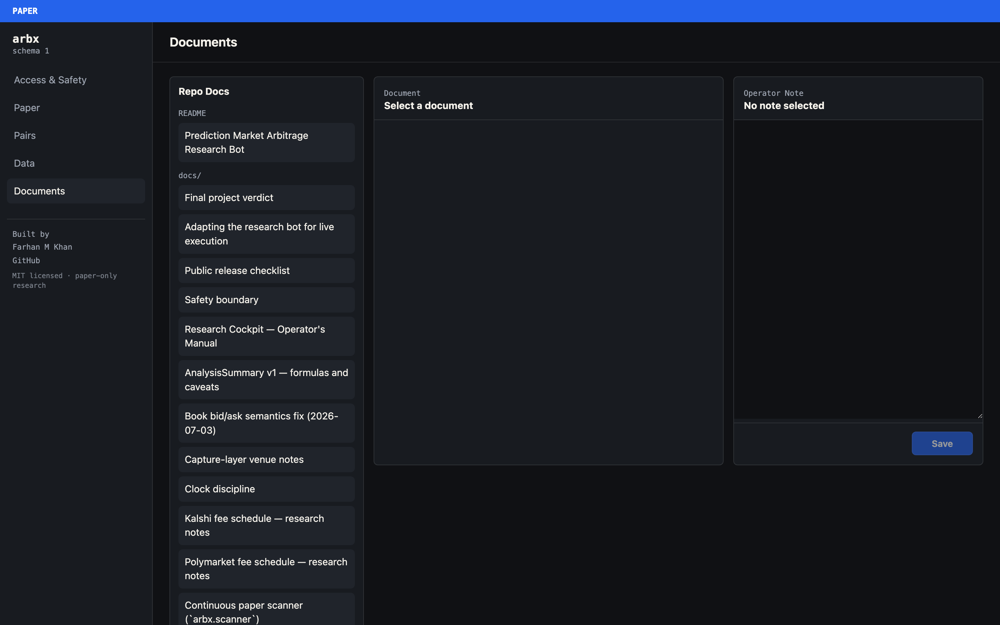
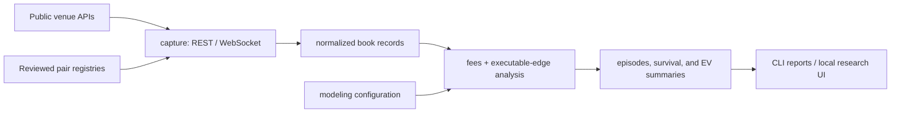

# Prediction Market Arbitrage Research Bot

[](LICENSE)
[](https://www.python.org/downloads/)
[](https://github.com/frahank/arb-exec-github/actions/workflows/ci.yml)

An archived, paper-only research bot for testing apparent arbitrage between
Kalshi and Polymarket.

By **[Farhan M Khan](https://farhank.dev)** — see [Author and credits](#author-and-credits).

The repository is named `arb-exec-github`; `arbx` is only the Python import
namespace used by the source code (for example, `from arbx.analysis import ...`).
It is not another repository or an external dependency.

## Quick start — macOS and Linux

Prerequisites: Git and Python 3.12 or newer. After cloning the repository:

```bash
cd arb-exec-github
./run
```

That single command creates `.venv`, installs the exact pinned runtime,
installs the local package, offers first-run Kalshi credential onboarding, and
starts the paper-only cockpit at <http://127.0.0.1:8710>.

Credential entry is hidden. The key ID and PEM path are stored outside the
checkout under `~/.arbx/credentials/` with restrictive permissions. The
launcher validates the PEM locally but never sends an order or enables an
order-capable path. Press `n` at the prompt—or use `./run --no-credentials`—to
use the public REST features without a key.

## The cockpit

`./run` opens a five-tab local research cockpit on 127.0.0.1. It is read-only
with respect to the venues: there is no order path behind any button.


The Paper tab states the project's verdict as a live number rather than a claim:
**23 scannable · 0 count toward strategy metrics.** A scan records real public
book data and produces no strategy result, because every pair in the bundled
registry was rejected during review.


Each pair carries three independent badges — settlement equivalence
(`verified_equivalent`), strategy eligibility (`excluded`), and scan status
(`approved_for_paper`). A pair can be equivalent and scannable while still being
excluded from every reported metric.


The Access & Safety tab surfaces all three real-order gates, the global kill
switch, and the credential store. Credential entry is storage-only and is not
wired to any trading path.



### What you will see on the first scan

The bundled registry ships 23 pairs, all of them scannable and **none** of them
strategy-eligible. Those are two different things:

- **Scannable** — the scanner may record the pair's public book. Governed by
  `status: approved_for_paper`.
- **Strategy-eligible** — the pair counts toward reported strategy metrics.
  Governed by `include_in_strategy_metrics`, which the loader forces to `false`
  unless the pair's equivalence is verified *and* its latest decision-log entry
  is `approve`.

Every pair in this registry was rejected during the original review, so a scan
records real data and produces no strategy result. That is the failed-experiment
verdict expressed in the data rather than only in prose. `./run --check` reports
all three counts so the distinction stays visible:

```
release check passed: mode=paper registry=23 scannable=23 strategy_eligible=0 ui_routes=5
```

To make a pair count toward strategy metrics you must review and approve it
yourself, via the Pairs tab or `scripts/review_pair_candidates.py`.

> **The bundled pairs are a dated snapshot — re-verify them before relying on any of
> them.** Each was reviewed against the venues' rules text as it read on that pair's
> recorded approval date. Prediction markets expire, settle, get delisted, get
> relisted under new tickers, and have their resolution criteria amended after
> listing, so a pair that was contract-equivalent then may be expired, altered, or no
> longer equivalent now. `make pair-health` checks that both legs are still live and
> reachable — that is **liveness, not equivalence**. A pair can be open on both venues
> and still settle differently. Confirming equivalence means re-reading both venues'
> current rules text yourself; see
> [`docs/pair_equivalence_checklist.md`](docs/pair_equivalence_checklist.md).
> Treat the registry as a worked example of the review format, not as a maintained
> feed of tradeable pairs.

Useful release/operator checks:

```bash
./run --check                 # bootstrap + offline release check; no UI
make test                     # full offline suite
make lint                     # pinned lint policy
make pair-health              # live, read-only validation of active pairs
```

## Verdict: failed experiment

This project did **not** establish a reliable, executable arbitrage strategy.
The most defensible overall verdict is **failed / not viable**:

- apparent opportunities usually disappeared after correct bid/ask handling,
  real fees, market-equivalence checks, capture-skew limits, and latency tests;
- the persistent gaps that survived were generally basis or long-duration carry,
  not capturable arbitrage;
- the recorded experiments did not justify continuing toward live execution.

The code is published because the capture, normalization, fee, safety, and analysis
work may still be useful to other researchers. Start with
[`docs/FINAL_VERDICT.md`](docs/FINAL_VERDICT.md) and
[`docs/book_semantics_fix.md`](docs/book_semantics_fix.md).

This is research software, not financial advice. It has no supported live-order
path and makes no claim of profitability.

## Adapting it in a private fork

Experienced developers who want to build their own execution layer can use the
paper system as a research dependency. The project intentionally does not ship a
live switch or order-capable adapter, but
[`docs/LIVE_ADAPTER_GUIDE.md`](docs/LIVE_ADAPTER_GUIDE.md) maps the reusable
components, recommended out-of-tree architecture, two-leg state machine, risk and
reconciliation requirements, staged test progression, and current official venue
documentation. Third-party live adapters are not supported or certified by this
project.

## Repository map

| Path | What it contains |
|---|---|
| `src/arbx/venues` | Read-only public Kalshi and Polymarket REST clients. |
| `src/arbx/capture` | Concurrent REST and market-data WebSocket capture. |
| `src/arbx/data` | Recording, normalization, freshness, quality checks, and compaction. |
| `src/arbx/pairs` | Pair registries, settlement-equivalence checks, and rules snapshots. |
| `src/arbx/fees` | Venue-specific fee models and unified fee calculations. |
| `src/arbx/analysis` | Executable edges, episodes, survival, and heatmaps. |
| `src/arbx/modeling` | Depth, latency, carry, failed-leg, and expected-value adjustments. |
| `src/arbx/scanner` | Continuous pair rotation and edge-row generation. |
| `src/arbx/services` | Application services used by the local UI. |
| `src/arbx/ui` | FastAPI routes, templates, static assets, and response schemas. |
| `src/arbx/accounts` | Read-only account inspection and external credential references. |
| `src/arbx/exec` | Kill-switch support only; no order execution. |
| `scripts/` | Runnable discovery, capture, analysis, UI, and safety commands. |
| `configs/` | Runtime settings, economic assumptions, and pair registries. |
| `tests/` | Regression, safety, integration, and UI tests plus minimal fixtures. |
| `docs/` | Current operating and methodology documentation only. |

The main data flow is:



### Choose a workflow

| Goal | Start here | Credentials |
|---|---|---|
| Discover markets | `scripts/discover_kalshi_public_markets.py` and `scripts/discover_polymarket_public_markets.py` | None |
| Record both venues by polling | `scripts/run_capture.py --mode rest_concurrent` | None |
| Record both venues event-by-event | `scripts/run_streaming_soak.py` | Kalshi key only |
| Analyze a completed capture | `scripts/run_soak_analysis.py` | None |
| Review candidate market pairs | `scripts/review_pair_candidates.py` | None |
| Open the research cockpit | `scripts/run_ui.py` | None for offline/public features |
| Run all regression tests | `python -m pytest -q` | None |

## Credentials and data modes

| Activity | Kalshi key | Polymarket key | Notes |
|---|---:|---:|---|
| Unit and offline fixture tests | No | No | Uses committed synthetic/public fixtures. |
| Public REST discovery and poll-driven capture | No | No | Both venues expose the market data used by these paths publicly. |
| Polymarket market-data WebSocket | No | No | Public subscribe-only stream. |
| Kalshi market-data WebSocket | **Yes** | No | Kalshi requires an API key ID and RSA private key for the WebSocket handshake. |
| Two-venue event-driven/streaming recording | **Yes** | No | The Kalshi leg cannot be truly event-driven without Kalshi credentials. |
| Live trading | Not supported | Not supported | No order-submission or cancellation capability is included. |

In short: **poll-driven testing works without keys from either venue. Streaming,
event-driven arb recording requires a Kalshi API key.** If no Kalshi credential is
available, `run_streaming_soak.py` can fall back to a Kalshi REST-poll stopgap, but
that is not equivalent to a true two-sided streaming capture.

## Developer setup

Python 3.12 is required.

```bash
python3.12 -m venv .venv
./.venv/bin/pip install -r requirements-dev.lock
./.venv/bin/pip install --no-build-isolation --no-deps -e .
./.venv/bin/python -m pytest -q
./.venv/bin/ruff check src tests scripts
```

`requirements.lock`, `requirements-dev.lock`, and
`requirements-analytics.lock` pin the complete supported environments. CI
runs the bootstrap, tests, lint, and distribution checks on both macOS and
Linux. The optional analytics tier has its own Linux test job.

See [`CONTRIBUTING.md`](CONTRIBUTING.md) for the development workflow and
[`docs/RELEASE_CHECKLIST.md`](docs/RELEASE_CHECKLIST.md) for the exact local
release gate.

## No-key polling examples

Discover public markets:

```bash
./.venv/bin/python scripts/discover_kalshi_public_markets.py --help
./.venv/bin/python scripts/discover_polymarket_public_markets.py --help
```

Run concurrent public REST capture with a reviewed pair registry:

```bash
./.venv/bin/python scripts/run_capture.py \
  --mode rest_concurrent \
  --pairs configs/pairs.approved.yaml \
  --data-dir data/soaks/example-rest \
  --duration 600
```

These paths use public read endpoints and do not need a Kalshi or Polymarket key.
They still make network requests and remain subject to venue availability, rate
limits, terms, and jurisdictional restrictions.

## Kalshi-authenticated streaming

Kalshi WebSocket market data requires an API key ID plus its RSA PEM. Store the
credential outside the repository:

```bash
./.venv/bin/arbx-store-credentials kalshi paper
```

The command writes a mode-600 YAML reference under
`~/.arbx/credentials/`; the PEM stays at the external path you provide. Then run:

```bash
./.venv/bin/python scripts/run_streaming_soak.py \
  --kalshi-stream ws \
  --kalshi-profile paper \
  --pairs configs/pairs.approved.yaml \
  --data-dir data/soaks/example-streaming \
  --hours 1
```

Never commit credential YAML, PEM files, `.env` files, wallet keys, or generated
auth headers. See [`SECURITY.md`](SECURITY.md) and
[`docs/USER_MANUAL.md`](docs/USER_MANUAL.md) for the operational details.

## What is included

- read-only Kalshi and Polymarket public-data clients;
- concurrent REST and WebSocket capture components;
- order-book normalization and the documented bid/ask semantics correction;
- pair-equivalence registries and review tooling;
- fee, executable-edge, survival, latency, and profitability analysis;
- a local FastAPI research cockpit;
- extensive tests and the small fixtures required to exercise them;
- deny-by-default paper-mode, kill-switch, credential-redaction, and no-order tests.

The large raw local soak archive is intentionally not part of the Git repository.
GitHub is not an appropriate home for the multi-gigabyte capture set. The committed
research evidence and result reports were also removed: this repository presents the
software, not the private research corpus. One readable public venue-response fixture,
[`tests/fixtures/rules_snapshot/kalshi_market.json`](tests/fixtures/rules_snapshot/kalshi_market.json),
is highlighted as a representative data sample. Other small files under
`tests/fixtures/` exist only to keep the offline test suite reproducible.

## Important limitations

- The repository is archived research, not a maintained trading system.
- Market APIs, schemas, fees, and venue rules may have changed since the 2026 runs.
- Similar market titles do not prove equivalent settlement conditions.
- Displayed-book calculations are not realized fills.
- Several historical reports document bugs or caveats; read their corrections and
  addenda before reusing results.
- The bundled registry is a small, checked-in starting point, not automatic
  proof of continuing market health. Run `make pair-health` before a long
  collection session — and note that it proves liveness only, never that two
  contracts still settle on the same conditions.
- Pairs expire. Markets from a past election, season, or dated cutoff will
  eventually settle and stop trading, and the registry does not prune itself.
  Re-review before reuse and archive what has closed.

The detailed safety boundary is in [`docs/SAFETY.md`](docs/SAFETY.md), and the
pair-testing workflow is in
[`docs/pair_testing_pipeline.md`](docs/pair_testing_pipeline.md).

## Author and credits

Built and researched by **Farhan M Khan**.

- Portfolio and project write-up: <https://farhank.dev>
- GitHub: <https://github.com/frahank>
- Contact: <Farhan.khanev@gmail.com>

The design decisions, fee and equivalence models, safety boundary, and the
negative result documented in [`docs/FINAL_VERDICT.md`](docs/FINAL_VERDICT.md)
are my own work. If you use this code or reproduce the methodology, a link back
to the repository or the write-up is appreciated but not required.

### Third-party components

This project depends on, but does not vendor, the following open-source
packages. Each remains under its own license; see the pinned versions in
[`requirements.lock`](requirements.lock) and
[`pyproject.toml`](pyproject.toml).

| Package | Purpose | License |
|---|---|---|
| [cryptography](https://github.com/pyca/cryptography) | RSA-PSS request signing | Apache-2.0 OR BSD-3-Clause |
| [FastAPI](https://github.com/fastapi/fastapi) | Local research cockpit | MIT |
| [Starlette](https://github.com/encode/starlette) / [uvicorn](https://github.com/encode/uvicorn) | ASGI framework and server | BSD-3-Clause |
| [Jinja2](https://github.com/pallets/jinja) | Cockpit templates | BSD-3-Clause |
| [markdown-it-py](https://github.com/executablebooks/markdown-it-py) | Document rendering | MIT |
| [PyYAML](https://github.com/yaml/pyyaml) | Config and registry parsing | MIT |
| [httpx](https://github.com/encode/httpx) | HTTP client | BSD-3-Clause |
| [websockets](https://github.com/python-websockets/websockets) | Market-data streams | BSD-3-Clause |
| [pydantic](https://github.com/pydantic/pydantic) | Response models (via FastAPI) | MIT |
| [pytest](https://github.com/pytest-dev/pytest) / [ruff](https://github.com/astral-sh/ruff) | Test and lint toolchain (dev only) | MIT |
| [DuckDB](https://github.com/duckdb/duckdb) / [PyArrow](https://github.com/apache/arrow) | Optional Parquet analytics tier | MIT / Apache-2.0 |

Kalshi and Polymarket are trademarks of their respective owners. This project
is not affiliated with, endorsed by, or supported by either venue, and it uses
only their documented public endpoints.

## License

MIT — Copyright (c) 2026 Farhan M Khan. See [`LICENSE`](LICENSE) for the full text.

Every source file under [`src/`](src) and [`scripts/`](scripts) carries an
`SPDX-License-Identifier: MIT` header, so the license travels with any file
that is copied out of the repository.
