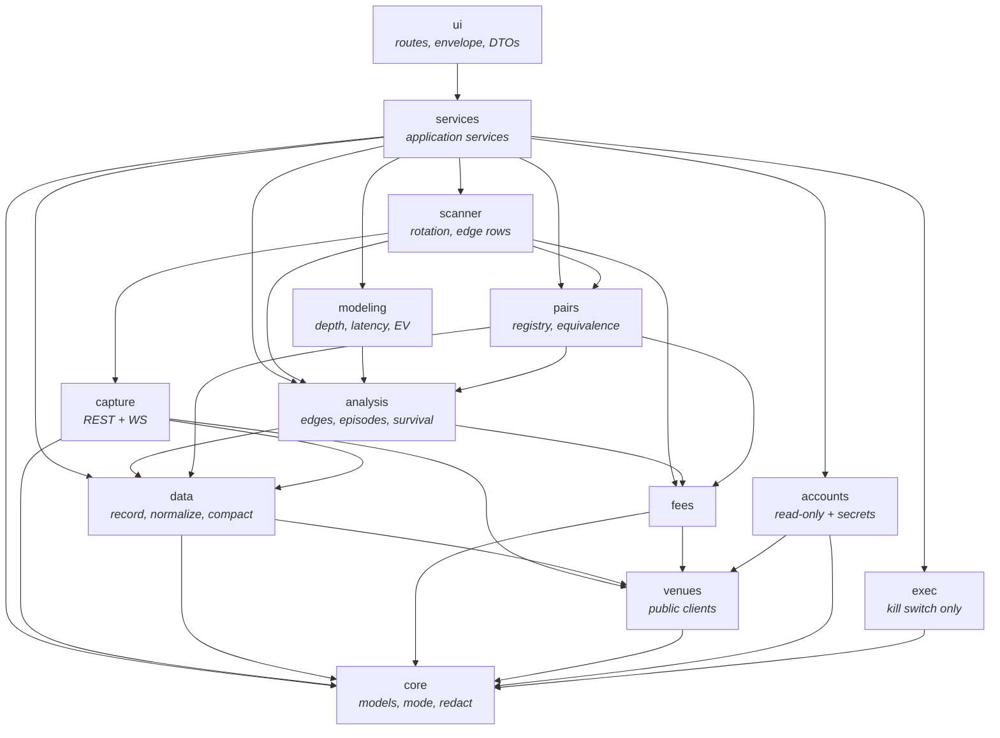
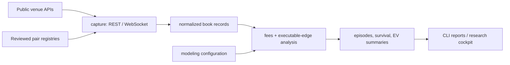

# Architecture

How this codebase is put together, which seams are real, and where the design
does not hold. The [README](../README.md) covers what the project is and what it
found; [`RUNNING.md`](RUNNING.md) covers how to operate it.

Everything below was derived from the source by walking the import graph, not
from memory. Where the layering is violated, this document says so — a map that
hides the mess is worse than no map.

## Layers

Thirteen packages under `src/arbx`, 80 modules. The intended direction of
dependency is downward: domain types at the bottom, the browser-facing surface
at the top.



That diagram shows the *intended* direction. Three back-edges violate it in
practice — `capture` ↔ `data`, `capture` ↔ `pairs`, and `services` ↔ `ui` — and
they are left out above so the intended shape stays readable. Each is described,
with its cause and its fix, in [Known architectural debt](#known-architectural-debt).

`core` is a true leaf: it imports nothing else from `arbx`. Domain models, the
runtime-mode gate, redaction, and path helpers live there, and everything else
is free to depend on them.

`exec` contains the kill switch and nothing else. There is no order path in this
repository, so `exec` has no venue clients and no dependency beyond `core`.

## The three seams

These are the joints the system was designed to be pulled apart at. Each is one
type or one table; if you are extending the project, start at whichever one
matches what you are adding.

### 1. Venue adapter — `venues/base.py::AdapterContract`

```python
class AdapterContract(ABC):
    def fetch_orderbook(self, market_id: str) -> OrderBook: ...
    def health(self) -> VenueHealth: ...
```

Two methods. `KalshiAdapter` and `PolymarketAdapter` implement it, and
`data/connector.py::AdapterMarketDataConnector` consumes it without knowing
which venue it holds. This is the cleanest seam in the codebase — and also the
narrowest, which is why adding a venue is still not a plug-in operation. See
[Adding a venue](#adding-a-venue).

### 2. Capture → decision → replay — `capture/types.py`

```python
class MarketDataSource(Protocol):
    def subscribe(self, pairs: list[PairSpec]) -> AsyncIterator[PairedSnapshot]: ...
```

`PairedSnapshot` is the single value that crosses from data collection into
analysis. A live REST poller, a WebSocket stream, and a replay driver are
interchangeable behind this protocol, which is what makes the same analysis code
run over live and recorded data.

`BookSnapshot.to_observation_row()` emits rows column-for-column compatible with
`data/recorder.py::book_to_observation`, so a snapshot taken in memory and a row
read back off disk are the same shape.

### 3. UI operations — `services/contracts.py::SEAM_OPERATIONS`

A table of 25 named operations (17 `GET`, 8 `POST`) across six groups: Shared,
Documents, Data, Pairs, Paper, Safety. Each row names the service attribute, the
method, and the request and response shapes.

`ui/app.py::_register_service_operations` walks that table and registers each
entry as `/api/<name>`. Adding an operation means adding one tuple and one
method on the matching Protocol — no route wiring. The browser calls named
operations only; there are no ad-hoc endpoints.

Every response goes through `ui/envelope.py`:

```json
{"ok": true, "data": {}, "error": null,
 "meta": {"schema_version": 1, "generated_at": "..."}}
```

Errors carry a stable machine code and a safe message. `ui/app.py::_safe_error`
maps exceptions onto that vocabulary so provider internals and tracebacks never
reach the client.

## Data flow



On disk, one scan produces one soak directory:

```text
data/soaks/scan_<YYYYMMDD-HHMMSS>[_EDGES]/
  manifest.json                        # soak_id, pair_keys, flags, schema_version
  raw/book/venue=*/<date>.jsonl        # only when record_books=true
  scan/opportunities/<date>.jsonl      # full edge rows plus scanner fields
  EDGES_<YYYYMMDD-HHMMSS>.jsonl        # one StandardizedEdgeRow per line
  scan_summary.json
```

`manifest.json` is required for new directories — `services/datastore.py` reads
it to list and resolve soaks for the UI. The optional analytics tier compacts
JSONL into Parquet for DuckDB queries; the recorder, data-quality report, and
edge tooling all run on pure stdlib without it. The full contract is in
[`soak_layout.md`](soak_layout.md).

## Adding a venue

**This is not a plug-in operation, and the code should not pretend otherwise.**

`AdapterContract` is generic, but the two-venue assumption did not stay behind
it. **42 of 80 modules name `kalshi` or `polymarket` directly**, including the
base domain model:

| Package | Modules naming a venue |
|---|---|
| `pairs` | 8 / 11 |
| `capture` | 6 / 8 |
| `fees` | 5 / 6 |
| `services` | 4 / 10 |
| `accounts` | 4 / 6 |
| `analysis` | 3 / 5 |
| `core` | 2 / 5 |
| `data` | 2 / 7 |
| `venues` | 2 / 5 |
| `modeling` | 2 / 3 |
| `scanner` | 2 / 4 |
| `ui` | 1 / 4 |
| `exec` | 0 / 2 |

The load-bearing blockers, each of which hardcodes exactly two venues by name:

| Location | What is hardcoded |
|---|---|
| `core/models.py:111` | `MarketPair.kalshi_market` / `poly_market` — literal fields on the base domain type |
| `capture/types.py:125` | `PairedSnapshot.kalshi` / `.polymarket` — the capture seam carries exactly two named legs |
| `fees/engine.py:47` | `FeeEngine.__init__(kalshi, polymarket)`, plus `leg_fee` dispatching on the venue string |
| `accounts/secrets.py:39` | `TEMPLATE_FIELDS` keyed by venue name; unknown venues are rejected |
| `analysis/edges.py:161` | Direction strings `kalshi_yes_poly_no` / `kalshi_no_poly_yes` baked into every edge row |
| `ui/schemas.py:74` | `StandardizedEdgeRow` carries `vwap_kalshi` / per-venue columns |

A third venue therefore means editing roughly forty modules, not registering a
plug-in. The honest sequence, cheapest first:

1. **Generalize the capture seam.** Replace `PairedSnapshot`'s two named fields
   with `legs: Mapping[str, BookSnapshot]` and compute skew across all legs.
   Keep `.kalshi` / `.polymarket` as thin properties so nothing downstream
   breaks on day one.
2. **Make directions data, not strings.** `kalshi_yes_poly_no` encodes a venue
   pair and a side pair in one identifier. A `(buy_venue, buy_side, sell_venue,
   sell_side)` tuple removes the venue names from every derived row.
3. **Make the venue registry data-driven.** One `VenueSpec` binding adapter, fee
   model, credential template, and WebSocket client, so registration is one
   entry instead of forty edits.
4. **Widen the price domain.** `OrderBookLevel` enforces `0 < price < 1`, which
   is correct for binary contracts and wrong for anything else. A per-instrument
   `PriceDomain` unblocks non-binary instruments.

## What is deliberately absent

These are omissions, not gaps waiting to be filled.

**No order path.** Nothing in this repository can place or cancel an order.
`exec` holds the kill switch only. Three tests enforce this as an architectural
invariant rather than a convention:

- `tests/test_accounts_readonly.py` walks every class under `arbx.accounts` and
  fails on any public method whose name contains an order or transfer term.
  `open_orders` (a read) is whitelisted by exact name.
- `tests/test_safety_boundary.py` asserts that `arbx.exec.live_*` modules do not
  exist.
- `tests/test_killswitch.py` asserts the kill switch exposes no un-engage method.

Adding execution therefore requires deliberately rewriting those tests, which is
the point: the boundary cannot be crossed quietly.
[`LIVE_ADAPTER_GUIDE.md`](LIVE_ADAPTER_GUIDE.md) maps the out-of-tree approach.

**No strategy abstraction.** There is no `Strategy` protocol, no signal type, and
no position or portfolio model. The strategy *is* the two hardcoded directions in
`analysis/edges.py`. A second strategy — mean reversion, statistical arbitrage —
has nowhere to live without introducing one.

**No database tier.** State is files: JSONL, YAML registries with sha256
sidecars, and optional Parquet. The larger private system this was extracted from
used PostgreSQL; that layer is not here.

**Batch, not event-driven.** The scanner is a subprocess launched per run that
writes JSONL for later analysis; its cadence knob is measured in seconds.
WebSocket capture exists but feeds the recorder, not a decision loop.

## Known architectural debt

Three mutual dependencies exist between packages. All three are real, none are
currently harmful, and each has a specific cause worth naming.

### `services` ↔ `ui` — 14 imports one way, 2 the other

`services` imports `ui.envelope` (`OpError`, `SCHEMA_VERSION`) and `ui.schemas`
(`StandardizedEdgeRow`, `PairSummary`, `AnalysisSummary`, …) in nine modules.
`ui` imports `services.contracts` and `services.stubs`.

The cause is placement, not design: `envelope.py` and `schemas.py` are the shared
*contract vocabulary* of the application, and they happen to live under `ui/`.
The same cause produces the one-way `scanner → ui` edge, where
`scanner/edges_writer.py:47` reaches into `ui.schemas` for a DTO.

**Fix:** move `envelope.py` and `schemas.py` to a leaf package (`arbx/contracts`)
that both `ui` and `services` depend on. That single move breaks this cycle and
the `scanner → ui` edge together.

### `capture` ↔ `data` — 2 imports one way, 1 the other

`capture/sink.py` imports `_DailyWriter` and `_resume_seq` from `data.recorder` —
**private names**, which is the sharper problem. `capture/types.py` imports
`data.freshness`, and `data/recorder.py` imports `capture.clock`.

**Fix:** promote the shared pieces. `freshness` and `clock` are both
venue-agnostic utilities that belong below both packages; the writer internals
`capture/sink.py` depends on should be a public interface or move with it.

### `capture` ↔ `pairs` — 4 imports one way, 5 the other

`capture` needs `PairSpec` to know what to subscribe to; `pairs/health.py` and
`pairs/targeted_soak.py` need capture to check whether pairs are live.
`targeted_soak.py` already works around this with function-local imports, which
is a symptom rather than a fix.

**Fix:** `PairSpec` is a data type with no behaviour and belongs in `core`
alongside the other domain models. Moving it removes the `capture → pairs`
direction entirely.

None of these are load-bearing today — the package boundaries hold at runtime
and the test suite does not depend on breaking them. They are recorded here
because an architecture document that only describes the intended shape is a
sales pitch, not a map.
